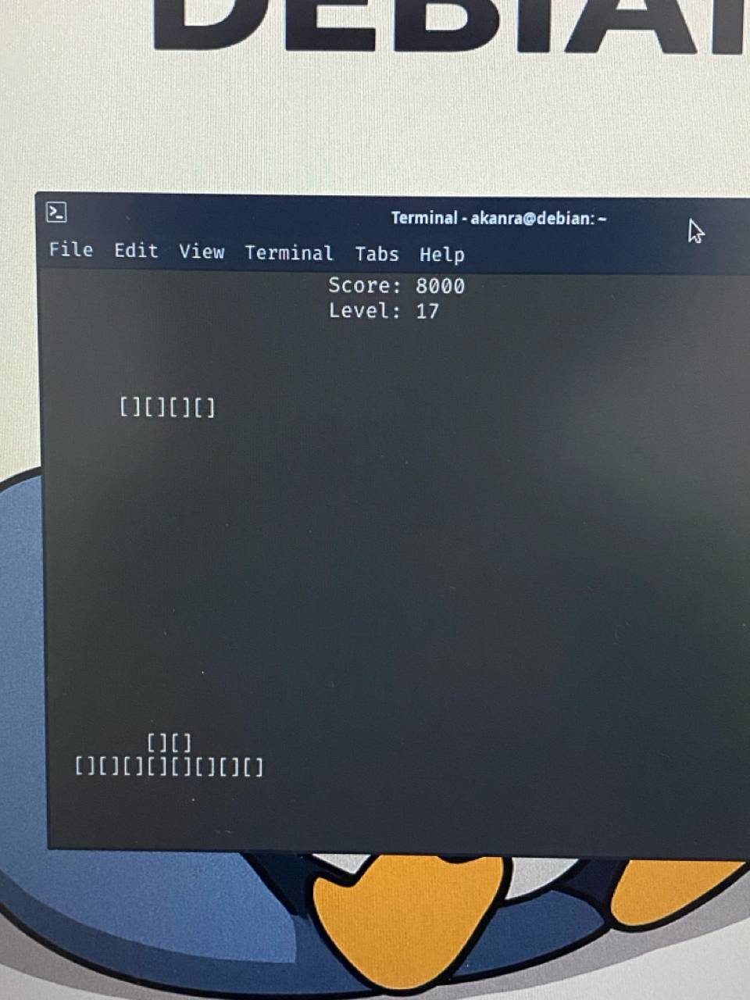
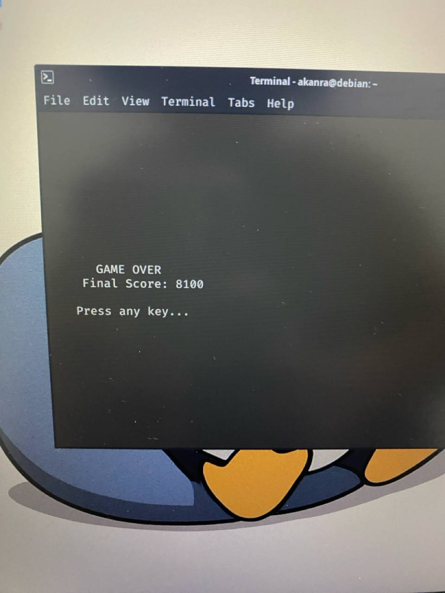

# 🐧 Tetris CLI

A simple Tetris game built with Python + curses.

## Features
- Scoring system
- Level progression
- Increasing speed
- Game over screen

## Controls
- A → Move left
- D → Move right
- S → Move down
- W → Rotate
- Q → Quit

## Requirements
Python 3 + curses (Linux)

## Screenshot

